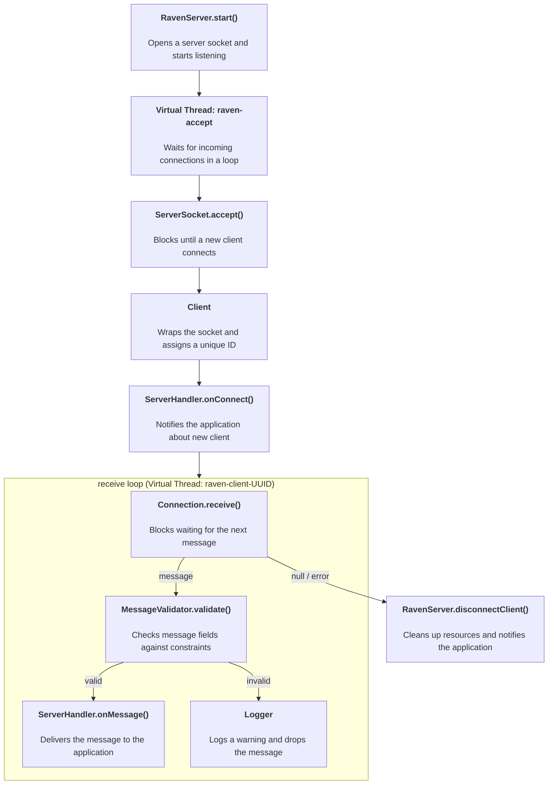
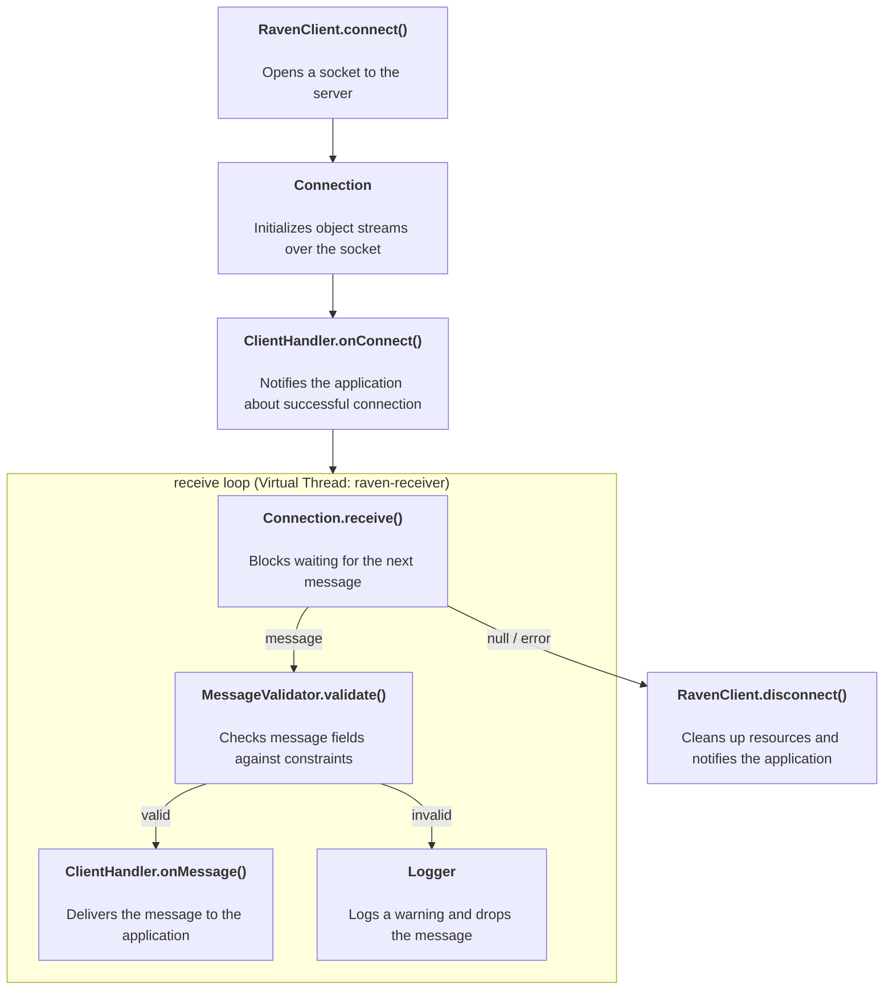
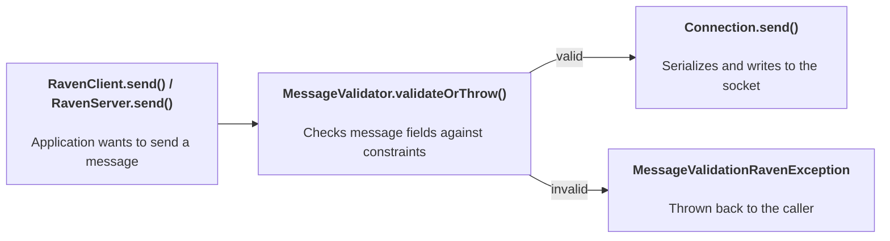

# Raven

Raven is a lightweight TCP networking framework for Java. It provides a pure Java transport layer and optional Spring integration with annotation-based message routing.

Named after messenger ravens — they carry your messages reliably.
Dedicated to my friend — the best 3D artist I know: https://www.deviantart.com/rav3nway

## Features

- Pure Java TCP transport (no Spring required)
- Virtual threads for scalable I/O
- Java Serialization over ObjectStream
- Annotation-based message dispatch for Spring applications
- Separate server and client routers with signature validation at startup
- Zero-configuration Spring auto-setup via properties

## Modules

| Module                | Description                                                                                         |
|-----------------------|-----------------------------------------------------------------------------------------------------|
| `raven-core`          | Pure Java transport: `RavenServer`, `RavenClient`, `Message`, `Client`                              |
| `raven-spring-core`   | Spring base: `AbstractMessageRouter`, `HandlerMethod`                                               |
| `raven-spring-server` | Server-side router + annotations (`@SubscribeMessage`, `@SubscribeConnect`, `@SubscribeDisconnect`) |
| `raven-spring-client` | Client-side router + annotations (`@SubscribeMessage`, `@SubscribeConnect`, `@SubscribeDisconnect`) |

## Quick Start

### 1. Define a message

```java
public final class PingMessage extends Message {
}

public final class PongMessage extends Message {
    private final long serverTime;
}
```

### 2. Server (Spring Boot)

Add dependency:
```xml
<dependency>
    <groupId>io.github.trimax</groupId>
    <artifactId>raven-spring-server</artifactId>
    <version>1.0.0</version>
</dependency>
```

Import the autoconfiguration:
```java
@SpringBootApplication
@Import(RavenServerAutoConfiguration.class)
public class ServerApp { }
```

Configure:
```properties
raven.server.port=9090
```

Write a handler:
```java
@Component
@RequiredArgsConstructor
public final class PingHandler {
    private final RavenServer server;

    @SubscribeMessage(PingMessage.class)
    public void onPing(Client sender, PingMessage message) {
        server.send(new PongMessage(System.currentTimeMillis()), sender.getId());
    }

    @SubscribeConnect
    public void onConnect(Client client) {
        log.info("Client connected: {}", client.getId());
    }
}
```

### 3. Client (Spring Boot)

Add dependency:
```xml
<dependency>
    <groupId>io.github.trimax</groupId>
    <artifactId>raven-spring-client</artifactId>
    <version>1.0.0</version>
</dependency>
```

Import the autoconfiguration:
```java
@SpringBootApplication
@Import(RavenClientAutoConfiguration.class)
public class ClientApp { }
```

Configure:
```properties
raven.client.host=localhost
raven.client.port=9090
```

Write a handler:
```java
@Component
public final class PongHandler {

    @SubscribeMessage(PongMessage.class)
    public void onPong(PongMessage message) {
        log.info("Server time: {}", message.getServerTime());
    }

    @SubscribeConnect
    public void onConnect() {
        log.info("Connected to server");
    }
}
```

### 4. Without Spring (pure Java)

```java
var server = new RavenServer(9090, new ServerHandler() {
    public void onConnect(Client client) { }
    public void onDisconnect(Client client) { }
    public void onMessage(Client sender, Message message) {
        server.send(new PongMessage(), sender.getId());
    }
});
server.start();

var client = new RavenClient("localhost", 9090, new ClientHandler() {
    public void onConnect() { client.send(new PingMessage()); }
    public void onDisconnect() { }
    public void onMessage(Message message) { }
});
client.connect();
```

## Send API

```java
// Broadcast to all connected clients
server.send(message);

// Send a message to specific client(s)
server.send(message, clientId);
server.send(message, clientA, clientB);
```

## Handler Signatures

### Server-side (`raven-spring-server`)

```java
@SubscribeMessage(MyMessage.class)
void method(Client sender, MyMessage message)

@SubscribeConnect
void method(Client client)

@SubscribeDisconnect
void method(Client client)
```

### Client-side (`raven-spring-client`)

```java
@SubscribeMessage(MyMessage.class)
void method(MyMessage message)

@SubscribeConnect
void method()

@SubscribeDisconnect
void method()
```

## Message Validation

Raven includes a declarative, annotation-based validation framework. Annotate message fields with constraint annotations and validation happens automatically on send and receive — no configuration needed.

### Annotations

| Annotation                | Applies to                      | Semantics                                |
|---------------------------|---------------------------------|------------------------------------------|
| `@NotNull`                | Any field                       | `field != null`                          |
| `@NotBlank`               | String                          | Not null and not blank (whitespace only) |
| `@NotEmpty`               | String, Collection, Array       | Not null and not empty                   |
| `@Length(min, max)`       | String                          | Length within [min, max]                 |
| `@Size(min, max)`         | Collection                      | Size within [min, max]                   |
| `@Min(value)`             | Number (byte, short, int, long) | `field >= value`                         |
| `@Max(value)`             | Number (byte, short, int, long) | `field <= value`                         |
| `@Range(min, max)`        | Number (byte, short, int, long) | Within [min, max]                        |
| `@DecimalMin(value)`      | Number (float, double)          | `field >= value`                         |
| `@DecimalMax(value)`      | Number (float, double)          | `field <= value`                         |
| `@DecimalRange(min, max)` | Number (float, double)          | Within [min, max]                        |
| `@Matches(pattern)`       | String                          | Matches regex pattern                    |
| `@Email`                  | String                          | Valid email format                       |
| `@Valid`                  | Any object field                | Recursively validates nested object      |

All annotations are in `io.github.trimax.raven.core.validation.annotation`.

### Example

```java
public final class LoginMessage extends Message {
    @NotBlank
    @Length(min = 3, max = 32)
    private String username;

    @NotNull
    @Email
    private String email;

    @Range(min = 1, max = 100)
    private int level;
}
```

### Nested Validation

Use `@Valid` to recursively validate nested objects. Violation paths use dot notation.

```java
public class UserData {
    @NotBlank
    private String name;

    @Email
    private String email;
}

public final class RegisterMessage extends Message {
    @NotNull
    @Valid
    private UserData userData;
}
```

If `userData.name` is blank, the violation's field name will be `"userData.name"`.

### Handling Validation Errors

```java
try {
    client.send(message);
} catch (MessageValidationException e) {
    System.err.println("Validation failed: " + e.getViolations());
}
```

`MessageValidationRavenException` contains a list of `Violation` records, each with the field name, constraint name, and a human-readable message.

### Null Handling

- If a field is `null` and `@NotNull` is **not** present — all other annotations skip validation for that field (null is considered valid).
- If a field is `null` and `@NotNull` **is** present — validation fails with a violation.
- `@NotBlank` and `@NotEmpty` implicitly check for null — they fail on null values.

### Behavior

**Send path** — `RavenClient.send()` and `RavenServer.send()` call `MessageValidator.validateOrThrow()` before sending. If validation fails, a `MessageValidationRavenException` is thrown and the message is NOT sent over the network.

**Receive path** — After a message is received, `MessageValidator.validate()` is called. If validation fails, a WARN is logged with the message type and violation details, and the message is silently dropped (handlers are not invoked).

### Dataflow

#### Server



#### Client



#### Sending a message



## Requirements

- Java 21+ (virtual threads)
- Spring Framework 6+ (for spring modules)

## License

Apache License 2.0
